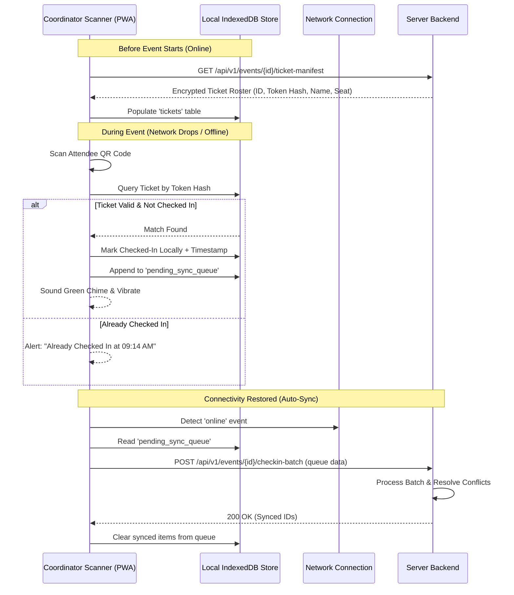

# Mobile-First UX, Scanner & Offline Check-in Architecture

> **Scope:** Mobile Navigation, Dedicated Scanner Mode, Offline-First Sync & PWA  
> **Status:** Phase 1 Deliverable — Mobile & Front-End Engineering Plan  

---

## 1. Mobile-First Design Philosophy

SapthaEvent's frontend must provide a seamless, native-app feel across all mobile form factors (tested across 320px, 375px, 390px, 414px, 768px, and desktop 1440px+):
- **Thumb-Zone Optimization:** Critical navigation, scan buttons, and primary actions sit within comfortable thumb reach (bottom 40% of viewport).
- **Minimum 48px Touch Targets:** Every button, tab, and input element satisfies WCAG 2.2 AA tap target spacing.
- **Fast Performance on Low-Bandwidth:** Vanilla CSS, zero heavy JS frameworks, lazy-loaded images, and local caching.

---

## 2. Participant Mobile Experience

### 2.1 Persistent Bottom Navigation Bar
When viewed on mobile (`@media (max-width: 768px)`), the top navigation bar condenses into a clean header, and a fixed bottom navigation bar activates:

```
┌─────────────────────────────────────────┐
│ [Logo] SapthaEvent            [🔔 2]   │
├─────────────────────────────────────────┤
│                                         │
│        Dynamic Page Content             │
│        (Event Cards / Schedule)         │
│                                         │
├─────────────────────────────────────────┤
│  🏠       🔍       🎟️       🏆      👤   │
│ Home   Explore   Tickets  Results Profile│
└─────────────────────────────────────────┘
```

### 2.2 Digital Ticket Wallet
- **Swipeable Passes:** Attendees with multiple registrations can swipe horizontally through their digital ticket passes.
- **QR Optimization:** High-contrast QR codes displayed on pure white cards with automated screen brightness guidance.
- **Gate & Seat Clarity:** Prominent badge displaying assigned Gate, Hall, Room, and Seat Number.
- **Add to Calendar & Offline Save:** One-tap `.ics` calendar sync and offline image caching.

---

## 3. Dedicated Coordinator Scan Mode

Organizers checking in thousands of attendees at peak registration windows need an uncompromising, high-speed scanning interface:

### 3.1 Scanner Viewport Layout
- **Full-Screen Viewfinder:** Uses `Html5Qrcode` or native WebRTC Barcode Detection API.
- **Instant Scan HUD:** 
  - Top: Live attendance counter (`Checked In: 642 / 1,000`).
  - Center: Targeting reticle with auto-focus and torch/flashlight toggle.
  - Bottom: Instant status banner (Green for Success, Yellow for Already Scanned, Red for Invalid).
- **Haptic & Audio Feedback:**
  - **Success:** 100ms vibration pulse + pleasant chime.
  - **Duplicate / Already Checked In:** Double short buzz + warning sound + display of original check-in timestamp.
  - **Invalid / Wrong Event:** Long error buzz + alert tone.

---

## 4. Offline-First Check-in Architecture

Network dead-zones in convention centers, basements, and sports fields are common. The scanner architecture guarantees 100% operational uptime without internet connectivity:



### Conflict Resolution Rules:
1. **First Verified Timestamp Wins:** If two coordinators scan the same ticket offline, the scan with the earlier verified timestamp is recorded as the valid entry.
2. **Audit Exception Logging:** Conflicting scans are preserved in the server audit log with device metadata for coordinator review.

---

## 5. PWA Lifecycle & Cache Integrity

- **Service Worker (`static/sw.js`):**
  - Static Asset Cache: `stale-while-revalidate` for CSS, fonts, and icons.
  - Dynamic API Requests: `network-first` with IndexedDB fallback.
  - Root scope registration: `/sw.js` registered at `/` to intercept all navigation routes.
- **Safe Version Upgrades:**
  - When a new deployment occurs, the service worker sends a `message` event to the client.
  - An unobtrusive toast appears: *"SapthaEvent has been updated. Tap to reload."*
  - Avoids aggressive cache busting that breaks active form inputs.
