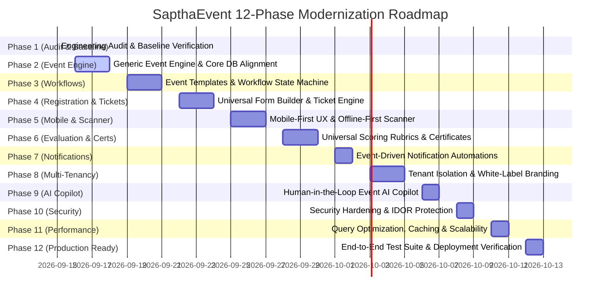

# Phased Implementation Roadmap & Execution Strategy

> **Master Plan:** Phased Evolution of SapthaEvent into a Universal Event Operating System  
> **Status:** Phase 1 Deliverable — Comprehensive Execution Strategy  

---

## 1. Phased Execution Roadmap

The implementation is structured into **12 systematic phases** adhering strictly to priority order:
- **P0 (Critical):** Security, Correctness, Data Integrity, Dual-DB Parity
- **P1 (Core Platform):** Generic Event Engine, Registration, Ticketing, Workflows
- **P2 (Operations & UX):** Mobile-First UX, Offline Scanner, Notifications
- **P3 (SaaS & Intelligence):** Multi-Tenancy, Branding, AI Copilot, Analytics
- **P4 (Polish & Scale):** Performance, Complete E2E Verification, Production Hardening

---

## 2. Phase-by-Phase Detailed Scope

### Phase 1: Engineering Audit & Baseline Verification ✅ *(COMPLETED)*
- Inspected complete codebase (40+ route modules, 14k+ lines of code).
- Verified baseline tests: **161 passed in 70.69s**.
- Identified architectural bottlenecks, technical debt, and database adapter drops.
- Authored 7 foundational architectural and specification documents.

### Phase 2: Generic Event Engine & Core Models (P0/P1)
- **Scope:** 
  - Upgrade `Event` model in `models_pg.py` and Firestore wrapper with new fields (`slug`, `event_mode`, `event_type`, `timezone`, `pricing_type`, `capacity`, `workflow_config_json`).
  - Fix `db_adapter.py` silent-drop bug by mapping `organizations`, `tickets`, `event_sessions`, `venues` to SQLAlchemy models and automatic fallback to `native_document_store`.
  - Implement SEO-friendly route `/events/<slug>` alongside legacy `/event/<event_id>`.
  - Add event lifecycle state transitions (`draft` → `published` → `registration_open` → `registration_closed` → `ongoing` → `completed`).
- **Verification:** Test event creation, retrieval by slug and ID across both Firestore and SQLite/Postgres.

### Phase 3: Reusable Event Templates & Configurable Workflow Engine (P1)
- **Scope:**
  - Build Template Library: Hackathon, Conference, Workshop, Seminar, Sports Tournament, Cultural Fest, Webinar.
  - Implement Event Cloning Engine (deep cloning of config, forms, and rubrics without copying attendees or payments).
  - Implement Workflow State Machine with guarded transitions, validation rules, and audit logging.
- **Verification:** Unit tests simulating workflow advancement for different event types.

### Phase 4: Universal Registration, Dynamic Forms & Multi-Tier Ticketing Engine (P1)
- **Scope:**
  - Enhance dynamic form builder with regex validation, conditional field display (`depends_on`), and secure file upload handling.
  - Implement `Ticket` entity with tiers (General, VIP, Speaker, Judge, Student).
  - Implement HMAC-SHA256 signed QR ticket tokens with timestamp and anti-replay protection.
  - Build responsive Digital Ticket Wallet view.
- **Verification:** Registration submission, ticket generation, and QR token signature verification tests.

### Phase 5: Mobile-First UX, Dedicated Scanner Mode & Offline Check-In (P2)
- **Scope:**
  - Implement persistent mobile bottom navigation bar (`Home`, `Explore`, `Tickets`, `Results`, `Profile`).
  - Build dedicated full-screen Coordinator Scan HUD with haptic/audio feedback and live counters.
  - Implement client-side IndexedDB caching of event attendee manifests.
  - Build background offline sync queue with conflict resolution.
- **Verification:** Browser simulation of network offline state, ticket check-in, and auto-sync when online.

### Phase 6: Universal Evaluation Engine, Results & Certification (P1/P2)
- **Scope:**
  - Extend scoring from simple numerical totals to pluggable rubrics: weighted scores, 5-star ratings, pass/fail, points, audience votes, and time-based metrics.
  - Automated tie-breaking logic and score audit logs.
  - Enhance ReportLab PDF generator with customizable layout metadata and distinct certificate categories (Winner, Runner-Up, Participant, Speaker, Judge).
  - Maintain cryptographic verification URL `/verify/<cert_id>` and QR code.
- **Verification:** Scoring calculations, round advancement, certificate PDF rendering, and verification lookups.

### Phase 7: Event-Driven Notification Engine & Automations (P2)
- **Scope:**
  - Build configurable trigger engine: `WHEN <event_trigger> THEN <channel_action>`.
  - Support multi-channel dispatch: Email (Flask-Mail), WhatsApp (UltraMsg), Web Push (pywebpush), In-app notification center.
  - Celery background worker queue for reliable non-blocking delivery.
- **Verification:** Task queuing tests, trigger matching, and mock channel dispatches.

### Phase 8: Multi-Tenancy & White-Label Branding (P3)
- **Scope:**
  - Enforce tenant isolation middleware across all blueprints.
  - Scope all queries by `organization_id`.
  - Dynamic white-label branding injection (logo, favicon, primary/accent colors, custom CSS variables).
  - Tenant admin dashboard for managing organization settings and members.
- **Verification:** Multi-tenant test verifying that Tenant A cannot view or alter Tenant B's events or attendees.

### Phase 9: Event AI Copilot (P3)
- **Scope:**
  - Upgrade Gemini AI integration from post-event reporting to an interactive Event Setup Copilot.
  - AI suggests event structure, form fields, schedule tracks, judging rubrics, and announcement drafts based on natural language prompts.
  - **Strict Guardrail:** AI changes are proposals only (`Suggestion` → `Interactive Preview` → `Admin Approval` → `Apply`).
- **Verification:** Prompt-to-schema translation test and human-approval validation.

### Phase 10: Security Hardening & Threat Mitigation (P0)
- **Scope:**
  - Purge exposed credentials from `README.md` and documentation.
  - Secure `/checkin/<event_id>/submit` requiring signed tokens or authenticated sessions.
  - Implement object-level access control (OLAC) on all ticket, submission, and profile routes.
  - Enforce 256-bit keys on JWT and secure cookie parameters.
  - File upload magic-byte verification and path traversal prevention.
- **Verification:** Bandit static security scan, CSRF validation tests, IDOR permission checks.

### Phase 11: Performance Optimization & Scalability (P4)
- **Scope:**
  - Implement cursor-based and offset pagination on all large listing queries.
  - Database index optimizations on composite query keys.
  - Redis caching for public event pages and static calendar feeds.
  - SSE connection management and keep-alive optimizations.
- **Verification:** Latency benchmarks on 1,000+ event and registration datasets.

### Phase 12: Production Testing, Verification & Final Documentation (P0/P4)
- **Scope:**
  - Run full test suite ensuring 0 regressions across all 161 existing tests + new feature tests.
  - Verify Cloud Run / Docker deployment containers.
  - Update `README.md`, `ARCHITECTURE.md`, `SECURITY.md`, `API.md`, and `EVENT_ENGINE.md`.
- **Verification:** Full automated CI pass and clean health-check responses.

---

## 3. Recommended Immediate Action

With Phase 1 (Audit, Test Verification, and Architectural Blueprints) complete, the recommended next step is to begin **PHASE 2: Generic Event Engine & Core Models**:
1. Update `models_pg.py` with the expanded universal `Event` schema and new entities.
2. Fix `db_adapter.py` to support `organizations`, `tickets`, and dynamic fallback persistence.
3. Verify that all 161 tests continue to pass with zero regressions.
