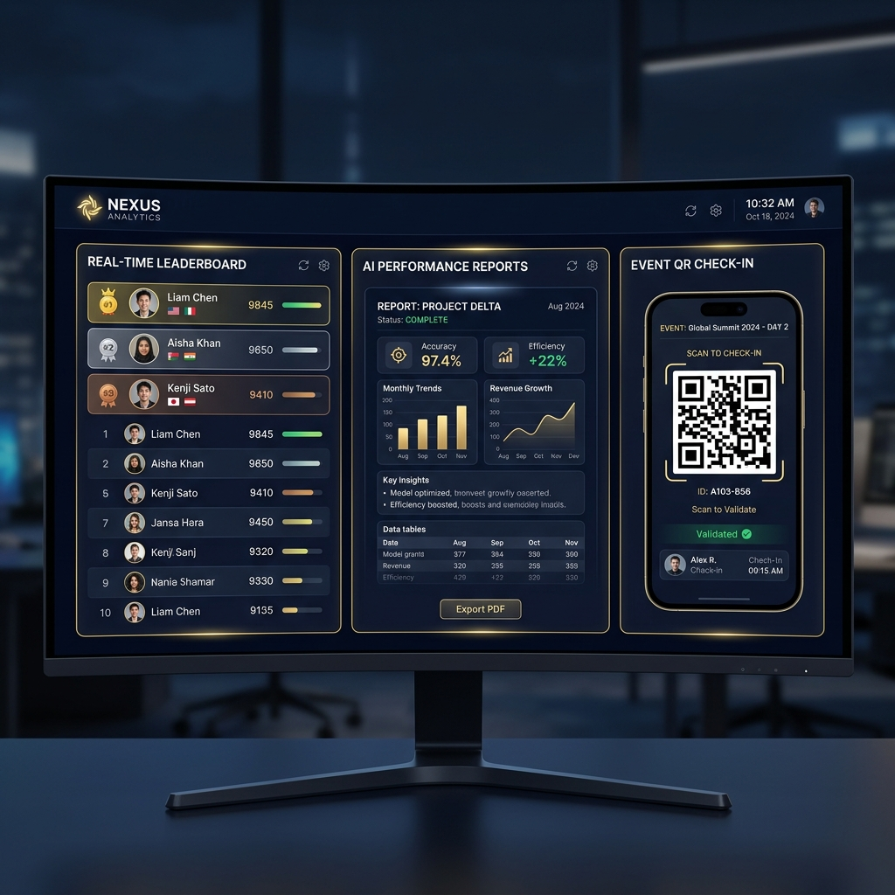

<div align="center">

<a href="https://saptha-event-portal-762269836348.us-east4.run.app/" target="_blank">
  
</a>

<br/><br/>

# [⚡ SapthaEvent](https://saptha-event-portal-762269836348.us-east4.run.app/)
### *Enterprise Event Intelligence & Orchestration Platform*

<p align="center">
  <b>Sapthagiri NPS University &nbsp;•&nbsp; Bengaluru, Karnataka &nbsp;•&nbsp; 2026</b>
</p>

[](https://saptha-event-portal-762269836348.us-east4.run.app/)
[](https://python.org)
[](https://flask.palletsprojects.com)
[](https://firebase.google.com)
[](https://ai.google.dev)
[](#)

<br/>

<table>
  <tr>
    <td align="center" width="50%">
      <h3>📲 Scan to Visit</h3>
      <a href="https://saptha-event-portal-762269836348.us-east4.run.app/" target="_blank">
        
      </a>
      <br/>
      <p><i>Point your camera scanner here to launch the live platform</i></p>
    </td>
    <td align="center" width="50%" valign="middle">
      <h3>🚀 Quick Launch</h3>
      <br/>
      <a href="https://saptha-event-portal-762269836348.us-east4.run.app/" target="_blank" style="text-decoration:none;">
        
      </a>
      <br/><br/>
      <p>Click the button above or the title "SapthaEvent" to access the live cloud environment.</p>
    </td>
  </tr>
</table>

</div>

---

<div align="center">

## 📸 Platform Showcase



</div>

---

## 🧭 Table of Contents

- [🌟 Why SapthaEvent?](#-why-sapthaevent)
- [🎭 Role-Based Access System](#-role-based-access-system)
- [✨ Flagship Features Deep Dive](#-flagship-features-deep-dive)
- [🏗 System Architecture](#-system-architecture)
- [🔧 Full Technology Stack](#-full-technology-stack)
- [📁 Repository Structure](#-repository-structure)
- [🚀 Local Setup Guide](#-local-setup-guide)
- [🔑 Demo Sandbox Accounts](#-demo-sandbox-accounts)
- [📡 API Reference](#-api-reference)
- [⚙️ CI/CD & Security](#️-cicd--security)
- [🤝 Contributing](#-contributing)
- [📜 License](#-license)

---

## 🌟 Why SapthaEvent?

Every university runs events. Most run them through a chaotic mix of Google Forms, WhatsApp groups, clipboard registers, and emails at 2am. **SapthaEvent eliminates all of that** — replacing manual chaos with an intelligent, real-time, multi-role orchestration platform purpose-built for academic institutions.

<table>
<thead>
<tr>
<th>❌ The Old Way</th>
<th>✅ The SapthaEvent Way</th>
</tr>
</thead>
<tbody>
<tr>
<td>Google Forms + manual Excel scoring</td>
<td>Dynamic JSON schema forms with real-time validation, team caps, and auto-confirmation emails</td>
</tr>
<tr>
<td>WhatsApp announcements at midnight</td>
<td>Instant Server-Sent Events (SSE) push — leaderboards update within 3 seconds on projectors</td>
</tr>
<tr>
<td>Paper attendance sheets at entry gates</td>
<td>QR code scanner check-in with anti-duplication, real-time attendance counters</td>
</tr>
<tr>
<td>Manual Canva certificates, weeks later</td>
<td>Auto-generated PDF certificates with cryptographic hashes, emailed instantly on result publish</td>
</tr>
<tr>
<td>No post-event insight</td>
<td>Gemini 2.5 Flash AI generates executive post-event reports in seconds — print-ready A4</td>
</tr>
<tr>
<td>No idea who attended what</td>
<td>Every student builds a verifiable XP portfolio with badges, event history, and public achievements</td>
</tr>
<tr>
<td>Manually typing results into email</td>
<td>Judge scorecard → average → rank → certificate → email → done. Zero human steps.</td>
</tr>
</tbody>
</table>

---

## 🎭 Role-Based Access System

SapthaEvent supports **6 distinct privilege levels**, each with tailored dashboards and tightly-scoped permissions enforced via Flask route decorators and session-based auth:

```
Super Admin
    │
    ├── Admin (per-college)
    │       ├── Club SPOC (per-club)
    │       │       ├── Judge (per-event)
    │       │       └── Coordinator (per-event)
    │       └── Head (cross-event analytics)
    │
    └── Student/Participant (self-serve)
```

| 🎖 Role | Dashboard URL | What They Can Do |
|:--------|:-------------|:-----------------|
| 🔴 **Super Admin** | `/admin/super` | Full platform override — create events, clubs, colleges; appoint SPOCs; configure master settings; view all analytics |
| 🟠 **Admin** | `/admin/dashboard` | User management, judge allocation, system health diagnostics, audit logs, sponsor management |
| 🟡 **Club SPOC** | `/spoc/dashboard` | Create & configure events, manage rounds, set scoring rubrics, open SSE scoreboards, trigger Gemini AI reports, broadcast emails, manage teams |
| 🟢 **Judge** | `/judge/dashboard` | Score teams in assigned rounds using configurable rubric sliders; view team submissions |
| 🔵 **Coordinator** | `/coordinator/dashboard` | QR ticket scanner check-in, live attendance counters, room-wise entry management, walk-in registration |
| ⚪ **Student** | `/participant/dashboard` | Event discovery, registration (solo/team), Razorpay payment, QR ticket download, certificate portfolio, XP/badge system |

---

## ✨ Flagship Features Deep Dive

### 📺 1. Real-Time SSE Projector Leaderboard
> *Route: `/live/<event_id>` — Designed for 100" projectors at crowded venues*

- Pure **Server-Sent Events (SSE)** — no WebSocket overhead, auto-reconnects, works through any firewall
- Pushes rank updates every **3 seconds** to all connected displays simultaneously
- **Animated rank transitions**: green flash ↑ on rise, red flash ↓ on drop
- **Podium visualization**: Top 3 rendered as a physical gold/silver/bronze podium with live scores
- Fullscreen-optimized layout — works on any projector/TV via browser, no app install needed
- Auto-switches from "Waiting..." to live rankings the moment scoring begins

---

### 🤖 2. Gemini 2.5 Flash AI Reports
> *One click. Complete post-event institutional intelligence.*

- SPOCs press one button — Gemini analyzes: attendance rates, score distributions, top performers, round-by-round data, club vs college breakdown
- Produces a **structured executive report**: highlights, participation stats, operational recommendations, gender/category breakdowns
- **Print-to-PDF**: Optimized `@media print` layout generates a clean A4 PDF straight from the browser — no third-party tools
- AI report stored in Firestore; re-accessible anytime from the SPOC dashboard

---

### 🛡️ 3. Cryptographic Certificate Engine
> *Route: `/verify/<cert_hash>` — Every certificate is a blockchain-grade artifact*

- **ReportLab PDF generation** with university branding, event metadata, rank, score, and date
- Each certificate carries a **unique cryptographic hash** (`itsdangerous` + `SHA-256`) stored in Firestore
- Public verification URL shareable on LinkedIn, WhatsApp, or resume
- Verification page features:
  - 🎉 **Canvas confetti** celebration animation on successful verify
  - 📱 **Responsive iframe preview** of the certificate
  - ⬇️ **Dynamic PDF download** generated on-demand
  - 🔗 **Copy-to-clipboard** verification URL
  - 📍 **Status timeline**: `Generated → Delivered → Claimed`
  - 🔗 **LinkedIn & X share** direct links pre-filled with achievement text

---

### 📧 4. Premium Transactional Email Engine
> *Auto-switching SMTP-free email pipeline — works on any cloud platform*

Emails rendered as **HTML table-based templates** (email-client safe) with:
- Navy gradient header matching the portal UI exactly
- Gold accent bars top & bottom (brand-consistent)
- University logo on transparent navy pill (always visible)

**Email types dispatched automatically:**

| Trigger | Email Sent |
|:--------|:----------|
| Student registers for event | Registration confirmation + event details |
| New user auto-created | Welcome email with login credentials |
| 24h before event | Reminder email with QR ticket |
| Result published | Rank notification + certificate PDF attachment |
| SPOC appointed | Role notification with login URL |
| Coordinator assigned | Event assignment confirmation |
| Password reset requested | Secure reset link (1hr expiry) |
| Room assigned | Room number with event schedule |

**Provider priority chain** (auto-detected at runtime):
1. `BREVO_API_KEY` → Brevo HTTP API ✅ *Railway-safe, 300 free/day, anyone*
2. `RESEND_API_KEY` → Resend HTTP API ⚠️ *Free, verified emails only*
3. Neither → Gmail SMTP 🔧 *Dev fallback*

---

### 🎫 5. QR Ticket & Check-In System

- Every registration generates a **unique QR code** (PyQRCode) encoding the registration ID
- QR code emailed as attachment 24h before event via Celery scheduled task
- Coordinators scan via **mobile camera scanner** (`/coordinator/scan`) — anti-duplicate detection
- Real-time attendance counter updates across all coordinator terminals via SSE
- Walk-in registration flow: coordinator creates account on-spot, auto-generates credentials, sends welcome email instantly

---

### 💰 6. Payment Gateway (Razorpay + Stripe)

- **Razorpay** integration for INR payments (primary, India-facing)
- **Stripe** integration for international payments
- Dynamic pricing rules: early-bird discounts, coupon codes, referral rewards
- Payment webhook verification with signature validation
- Failed payment recovery with retry mechanisms
- All transactions logged in Firestore with audit trails

---

### 👥 7. Team Management System

- SPOCs configure: min/max team size, team creation deadline, allowed college domains
- Students form teams, invite members by email, elect team leaders
- Real-time slot availability checking — prevents over-registration
- Team submission portal for multi-file uploads
- **Team matchmaking**: AI-assisted suggestions for solo participants seeking teams (`/matchmaker`)

---

### 🏆 8. Student Achievement Portfolio

- Every student accumulates **XP points** (configurable per event category)
- Unlockable **badge system**: 🥇 First Place, 🎯 Perfect Score, ⚡ Early Bird, 🔥 Streak badges
- Public portfolio URL: `/portfolio/<student_id>`
- Embeddable achievement widget for LinkedIn profiles
- Complete event history with certificates, ranks, and scores
- Club-level leaderboards showing cross-event standings

---

### 📊 9. Advanced Analytics Engine

- **SPOC Analytics**: per-event registration trends, score distribution charts, demographic breakdown
- **Admin Analytics**: cross-event comparison, revenue summaries, club performance rankings
- **Audit Logger**: every admin action logged with timestamp, IP, and user — downloadable as PDF
- **Feedback System**: post-event structured feedback forms; SPOC can view sentiment analysis

---

### 🔔 10. Multi-Channel Notifications

- **In-App**: Real-time notification bell with SSE push (no polling)
- **Email**: Brevo HTTP transactional queue
- **WhatsApp**: Twilio Business API integration (optional)
- **Push Notifications**: Web Push API (service worker registered) for mobile browser alerts

---

## 🏗 System Architecture

```
                    ┌─────────────────────────────────────────────┐
                    │          Browser / Mobile Client             │
                    │   (Vanilla JS + Bootstrap 5 + FontAwesome)  │
                    └────────────────────┬────────────────────────┘
                                         │  HTTPS / SSE
                                         ▼
                    ┌─────────────────────────────────────────────┐
                    │         Google Cloud Run Container           │
                    │    Flask 3.x + Gunicorn (4 workers)         │
                    │    Security: Flask-Talisman + Rate Limiter   │
                    └──┬──────────────┬──────────────┬────────────┘
                       │              │              │
           ┌───────────▼──┐   ┌───────▼──────┐  ┌──▼────────────┐
           │   Firestore   │   │  Celery 5.x  │  │  Google       │
           │   (NoSQL DB)  │   │  Task Queue  │  │  Cloud        │
           │   Real-time   │   │  (Redis      │  │  Storage      │
           │   Listeners   │   │   Broker)    │  │  (Assets)     │
           └───────────────┘   └──────┬───────┘  └───────────────┘
                                      │
              ┌───────────────┬───────┴──────┬───────────────┐
              ▼               ▼              ▼               ▼
        ┌──────────┐   ┌──────────┐  ┌──────────┐   ┌──────────┐
        │ Gemini   │   │  Brevo   │  │ Razorpay │   │  Twilio  │
        │ 2.5 Flash│   │  Email   │  │  Stripe  │   │WhatsApp  │
        │ AI API   │   │  API     │  │ Payments │   │  API     │
        └──────────┘   └──────────┘  └──────────┘   └──────────┘
```

**Data Flow:**
```
Student Registers → Firestore Write → Celery Email Task → Brevo API → Inbox
Judge Scores       → Firestore Write → SSE Push         → Leaderboard updates in 3s
Result Published   → Firestore Write → Celery Cert Task → PDF gen → Email with attachment
SPOC Requests AI   → Gemini API      → Report stored    → Print-to-PDF available
```

### 🔄 11. Database Independence & SQLFirestoreAdapter
The application implements an intermediate database abstraction layer: the `SQLFirestoreAdapter` (`db_adapter.py`). This adapter translates standard NoSQL queries (e.g. `db.collection('users').document(email).get()`) into equivalent relational SQL transactions at runtime. This allows developers to use a unified interface, rendering the application entirely portable between Google Cloud Firestore and standard PostgreSQL.

### 📱 12. Zero-Scroll Mobile Login Page
The mobile login page features dynamic viewport locking (`100dvh` container height) with hidden scrollbars to prevent scrolling. When a user selects the `Super Admin` role, which requires an additional `Master Secret Key` field, the viewport styles automatically respond via CSS transitions to resize paddings and branding margins, preventing overflow even on small screens.

### 🔄 13. PWA Lifecycle & Live Update Flow
To keep users in sync without disruptive page refreshes:
1. Service worker waiting states are explicitly managed.
2. If an update is detected, the install button changes dynamically to an "Update App" button.
3. Clicking "Update App" sends a `SKIP_WAITING` message to the service worker, and the client automatically refreshes the window upon `controllerchange`.

### ♿ 14. WCAG Accessibility & Dark Mode High-Contrast Overlays
To comply with WCAG text-readability rules:
- Light-red/green Bootstrap validation message overlays are adjusted to high-contrast semi-transparent variables (`rgba(239, 68, 68, 0.18)`) in dark mode (`data-theme="dark"`).
- Input borders and validation texts are styled to ensure clear visibility without fading.
- Non-numeric inputs on `type="tel"` elements (e.g., student phone numbers) are stripped in real-time.

---

## 🔧 Full Technology Stack

### Backend Core
| Component | Technology | Purpose |
|:----------|:-----------|:--------|
| Web Framework | **Flask 3.x** | Route handling, Jinja2 templates, SSE streaming |
| WSGI Server | **Gunicorn** | Production multi-worker HTTP server |
| Task Queue | **Celery 5** + Redis | Async email, PDF generation, scheduled reminders |
| Dev Scheduler | **APScheduler** | Local dev fallback when Redis unavailable |

### Database & Storage
| Component | Technology | Purpose |
|:----------|:-----------|:--------|
| Primary DB | **Google Cloud Firestore** | NoSQL real-time document database |
| Relational (Alt) | **PostgreSQL** via Supabase/AWS RDS | Industrial SQL upgrade path |
| File Storage | **AWS S3** / **Google Cloud Storage** | Certificate PDFs, event assets |
| ORM/Migration | **SQLAlchemy + Alembic** | Schema migration for PostgreSQL path |

### AI & Intelligence
| Component | Technology | Purpose |
|:----------|:-----------|:--------|
| AI Reports | **Google Gemini 2.5 Flash** | Post-event analysis, executive summaries |
| Team Matching | **AI Matchmaker** (`routes_ai_matching.py`) | Solo participant → team suggestions |
| Chatbot | **Gemini + Flask SSE** | Event assistant chatbot (`/chatbot`) |

### Security & Auth
| Component | Technology | Purpose |
|:----------|:-----------|:--------|
| Password Hashing | **Werkzeug scrypt** | Industry-standard PBKDF2 equivalent |
| Token Signing | **itsdangerous** | Reset tokens, certificate hashes, signed URLs |
| 2FA | **PyOTP** (TOTP) | Optional two-factor authentication |
| JWT | **PyJWT** | API token authentication |
| OAuth | **auth_oauth.py** | Google SSO login |
| Rate Limiting | **Flask-Limiter** | DDoS protection, brute-force prevention |
| HTTPS Headers | **Flask-Talisman** | CSP, HSTS, XSS protection headers |
| CSRF | **Flask-WTF** | Form submission protection |
| Input Validation | **Server-side sanitization** | Security validation middleware |
| Audit Trail | **Audit Logger** | Record critical actions with IP mapping |
| Secrets | **Environment variables** | Conf and API key protection |

### Documents & Media
| Component | Technology | Purpose |
|:----------|:-----------|:--------|
| PDF Certificates | **ReportLab** | Pixel-perfect branded PDF generation |
| QR Codes | **qrcode + Pillow** | Ticket QR generation with logo embed |
| Excel Export | **openpyxl + pandas** | Registration lists, score sheets |

### Payments
| Gateway | Provider | Use Case |
|:--------|:---------|:---------|
| India Payments | **Razorpay** | INR registrations with UPI/card/wallet |
| International | **Stripe** | Global card payments |
| Coupons | Custom engine | Percentage & flat discounts, referral codes |

### Communications
| Channel | Provider | Trigger |
|:--------|:---------|:--------|
| Transactional Email | **Brevo HTTP API** | All automated emails (primary) |
| Email Fallback | **Gmail SMTP** | Dev/backup path |
| WhatsApp | **Twilio Business API** | Optional event reminders |
| Push Notifications | **Web Push API** | Browser push (mobile-friendly) |

---

## 📁 Repository Structure

```
saptha-event-portal/
│
├── 🐍 Core Application
│   ├── app.py                    # Flask application factory & route registration
│   ├── config.py                 # Environment-aware configuration classes
│   ├── models.py                 # Firestore model helpers
│   ├── extensions.py             # Flask extension instances
│   └── celery_app.py             # Celery application + broker config
│
├── 🛣️ Route Modules (40+ blueprints)
│   ├── routes_auth.py            # Login, logout, registration, password reset, 2FA
│   ├── routes_spoc.py            # Club SPOC full event lifecycle
│   ├── routes_coordinator.py     # Check-in scanner, attendance, walk-ins
│   ├── routes_admin.py           # Admin dashboard, user management
│   ├── routes_participant.py     # Student dashboard, registration
│   ├── routes_forms.py           # Dynamic form schema engine
│   ├── routes_verification.py    # Certificate verify, preview, download
│   ├── routes_live.py            # SSE real-time leaderboard streaming
│   ├── routes_judge.py           # Judge scoring interface
│   ├── routes_payment.py         # Razorpay payment integration
│   ├── routes_payment_stripe.py  # Stripe payment integration
│   ├── routes_teams.py           # Team creation, invites, management
│   ├── routes_analytics.py       # Analytics dashboard data APIs
│   ├── routes_gamification.py    # XP, badges, achievements
│   └── routes_notifications.py   # SSE push notification system
│
├── 🛠️ Utilities
│   ├── utils_email.py            # HTML email templates + multi-provider send
│   ├── utils_certificate.py      # ReportLab PDF certificate generation
│   ├── utils_qr.py               # QR code generation with logo
│   ├── utils_validation.py       # Form validation, sanitization
│   ├── utils_whatsapp.py         # Twilio WhatsApp helpers
│   └── utils_storage.py          # S3/GCS/local file storage adapter
│
├── 📋 Task Workers
│   ├── tasks/email_tasks.py      # Async email delivery tasks
│   ├── tasks/cert_tasks.py       # Certificate generation + email pipeline
│   └── scheduler.py              # APScheduler cron jobs (reminders)
│
├── 🔐 Security
│   ├── security_middleware.py    # Request filtering, header enforcement
│   ├── audit_logger.py           # Admin action audit trail
│   ├── auth_2fa.py               # TOTP two-factor auth flow
│   ├── auth_jwt.py               # JWT token validation middleware
│   └── auth_oauth.py             # Google OAuth2 SSO integration
│
├── 🗄️ Database
│   ├── db_adapter.py             # Firestore ↔ PostgreSQL adapter
│   ├── models_pg.py              # SQLAlchemy ORM models for PostgreSQL
│   └── firestore.rules           # Firestore security rules
│
├── 🎨 Frontend
│   ├── static/css/global.css     # 2600+ line unified design system
│   ├── static/js/                # Vanilla JS modules (scanner, charts, SSE)
│   └── static/snpsu-logo.png     # University logo (navy-transparent)
│
└── 🧪 Tests
    ├── tests/                    # 145 unit + integration tests
    └── pytest.ini                # Test configuration
```

---

## 🚀 Local Setup Guide

### Prerequisites
- Python 3.10+
- Git
- A Firebase project with Firestore enabled
- (Optional) Redis for Celery task queue

### Step 1 — Clone & Create Virtual Environment

```bash
git clone https://github.com/kirancodes-dev/saptha-event-portal.git
cd saptha-event-portal

python3 -m venv .venv
source .venv/bin/activate      # macOS/Linux
# .venv\Scripts\activate       # Windows

pip install -r requirements.txt
```

### Step 2 — Configure Environment

```bash
cp .env.example .env
```

Edit `.env` with your values (ensure no API keys are exposed publicly).

### Step 3 — Firebase Credentials

Download your Firebase service account JSON from the Firebase console, rename it to `serviceAccountKey.json`, and place it in the project root.

### Step 4 — Initialize Super Admin

```bash
python fix_superadmin.py
```

### Step 5 — Start Development Server

```bash
python app.py
```

---

## ☁️ Production Cloud Run Deployment

Deployment configurations and scripts are designed to build and scale containers efficiently using Google Cloud Build.

### Deploy Command

To build and deploy the container image directly to Google Cloud Run:
```bash
gcloud run deploy saptha-event-portal \
    --source . \
    --region us-east4 \
    --allow-unauthenticated
```

---

## 🔑 Demo Sandbox Accounts

Test the system on our production sandbox.

| 🎭 Role | 📧 Email | 🔑 Password | 🔗 Dashboard |
|:--------|:---------|:------------|:------------|
| **Student / Participant** | `student@demo.com` | `Demo1234` | `/participant/dashboard` |
| **Club SPOC** | `spoc@demo.com` | `Demo1234` | `/spoc/dashboard` |
| **Judge** | `judge@demo.com` | `Demo1234` | `/judge/dashboard` |
| **Coordinator** | `coordinator@demo.com` | `Demo1234` | `/coordinator/dashboard` |
| **Admin** | `admin@demo.com` | `Demo1234` | `/admin/dashboard` |

*Note: Destructive operations are restricted on demo accounts to preserve state integrity.*

---

## 📡 API Reference

Interactive endpoints are documented at `/developer/api-docs` (access via the portal once running).

| Method | Endpoint | Description |
|:-------|:---------|:------------|
| `GET` | `/api/v1/events` | List all public events |
| `GET` | `/api/v1/events/<id>` | Event details + registration stats |
| `GET` | `/api/v1/events/<id>/leaderboard` | Live ranked leaderboard |
| `GET` | `/api/v1/verify/<cert_hash>` | Certificate verification |

---

## ⚙️ CI/CD & Security

### Automated Workflow Pipeline

- **Linter**: `ruff` static code analysis.
- **Security Audit**: `bandit` vulnerability detection.
- **Testing**: `pytest` running all 145 checks across core functions.
- **Continuous Deployment**: Automated integration with Google Cloud Run.

---

## 🤝 Contributing

We welcome contributions! Please open an issue or submit a pull request matching our project architecture.

---

## 📜 License

MIT License

Copyright (c) 2026 Sapthagiri NPS University

Permission is hereby granted, free of charge, to any person obtaining a copy
of this software and associated documentation files (the "Software"), to deal
in the Software without restriction, including without limitation the rights
to use, copy, modify, merge, publish, distribute, sublicense, and/or sell
copies of the Software, and to permit persons to whom the Software is
furnished to do so, subject to the following conditions:

The above copyright notice and this permission notice shall be included in all
copies or substantial portions of the Software.

---

<div align="center">


<br/>

**Built with ❤️ at Sapthagiri NPS University, Bengaluru**

*Python · Flask · Firestore · Gemini AI · Celery · Brevo · ReportLab · Cloud Run*

<br/>

© 2026 Sapthagiri NPS University · All Rights Reserved

</div>
