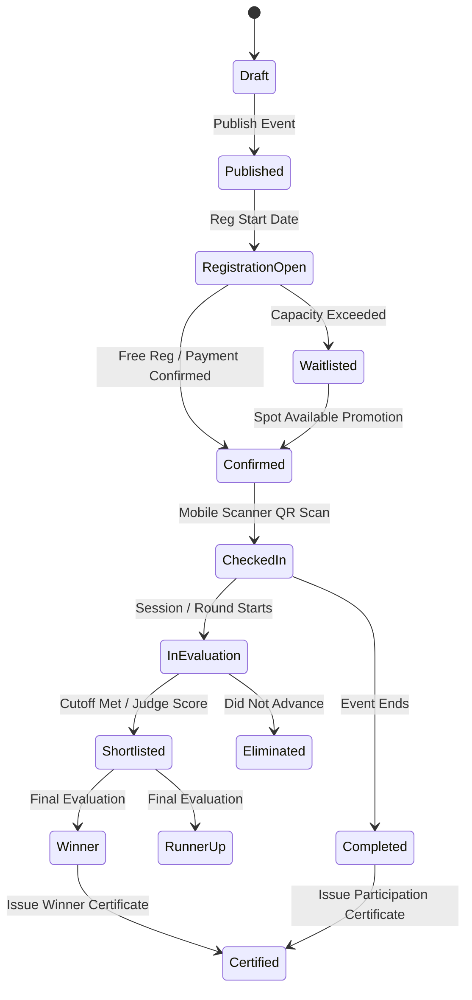

# Universal Event Engine: Architectural Blueprint & Specification

> **Status:** Phase 1 Deliverable — Engineering Blueprint  
> **Target:** SapthaEvent Operating System (Universal Event Platform)  

---

## 1. Vision & Core Philosophy

The primary architectural shift in SapthaEvent is:
$$\text{Hardcoded College Event Pages} \longrightarrow \text{Configuration-Driven Event Engine}$$

An event is no longer a fixed record of a college fest with hardcoded rounds. Instead, an event is an orchestrated instance of a **Generic Event Pipeline**:

```
┌──────────────────────────────────────────────────────────┐
│                    ORGANIZATION (TENANT)                 │
└────────────────────────────┬─────────────────────────────┘
                             │
                             ▼
┌──────────────────────────────────────────────────────────┐
│                      EVENT INSTANCE                      │
│  (Config: Metadata, Mode, Dates, Capacity, Branding)     │
└──────────────┬─────────────────────────────┬─────────────┘
               │                             │
               ▼                             ▼
┌───────────────────────────┐ ┌────────────────────────────┐
│      MODULE BUNDLE        │ │       WORKFLOW ENGINE      │
│  - Custom Form Builder    │ │  - Registration State      │
│  - Ticket Tiers & Gates   │ │  - Check-in Transition     │
│  - Sessions & Tracks      │ │  - Evaluation & Rounds     │
│  - Evaluation Rubrics     │ │  - Results & Publication   │
│  - Notification Triggers  │ │  - Certificate Issuance    │
└───────────────────────────┘ └────────────────────────────┘
```

**Zero Source Code Modifications for New Event Types:** Administrators can define any event—from a 36-hour hackathon to an international academic conference or a corporate webinar—purely through JSON configurations and UI wizards.

---

## 2. Event Model & Specification

The updated `Event` model supports the following unified schema across Firestore and PostgreSQL:

```python
{
    # Core Identity & Scoping
    "id": "uuid-or-string",
    "organization_id": "tenant-uuid",       # Strict tenant isolation
    "title": "Global AI Summit 2026",
    "slug": "global-ai-summit-2026",        # SEO-friendly public URL
    "short_description": "Premier international artificial intelligence summit.",
    "description": "Comprehensive markdown or HTML event overview...",
    
    # Classification & Modes
    "event_type": "conference",              # conference, hackathon, workshop, sports, cultural, webinar, etc.
    "category": "Artificial Intelligence",
    "event_mode": "hybrid",                  # offline | online | hybrid
    "status": "published",                   # draft | published | registration_open | registration_closed | ongoing | completed | cancelled | archived
    "visibility": "public",                  # public | unlisted | private | invite_only
    
    # Logistics & Schedule
    "timezone": "Asia/Kolkata",
    "start_datetime": "2026-10-15T09:00:00+05:30",
    "end_datetime": "2026-10-17T18:00:00+05:30",
    "reg_open_datetime": "2026-08-01T00:00:00+05:30",
    "reg_close_datetime": "2026-10-10T23:59:59+05:30",
    "venue": {
        "name": "Main Auditorium & Convention Center",
        "address": "Tech Campus, Bengaluru, Karnataka",
        "coordinates": {"lat": 13.0645, "lng": 77.5026},
        "gates": ["Gate 1 (VIP)", "Gate 2 (General)", "East Hall Entrance"]
    },
    "online_meeting_url": "https://stream.sapthaevent.com/live/global-ai-summit-2026",
    
    # Capacity & Limits
    "capacity": 1500,
    "current_registration_count": 842,
    "waitlist_enabled": True,
    "waitlist_capacity": 300,
    "team_settings": {
        "allow_teams": False,                # True for hackathons/sports, False for conferences
        "allow_individuals": True,
        "min_team_size": 1,
        "max_team_size": 1
    },
    
    # Pricing & Currency
    "pricing_type": "paid",                  # free | paid | donation
    "currency": "INR",                       # INR | USD | EUR | GBP
    "tax_percentage": 18.0,                  # GST / VAT calculation
    
    # Sub-Engine Configurations
    "ticket_tiers_config": [...],            # General, VIP, Student, Speaker
    "workflow_config": {...},                # Custom state machine
    "evaluation_config": {...},              # Rubrics, criteria, judges
    "notification_triggers": [...],          # Automation rules
    "certificate_config": {...},             # Template, signatures, badges
    "branding": {
        "banner_url": "https://...",
        "logo_url": "https://...",
        "primary_color": "#1e3a8a",
        "accent_color": "#f59e0b"
    },
    
    # Metadata
    "created_by": "organizer@summit.org",
    "created_at": "2026-07-01T10:00:00Z",
    "updated_at": "2026-09-15T12:00:00Z"
}
```

---

## 3. Pre-Built Event Templates

Event Templates provide turnkey presets that initialize all sub-engines. An administrator selects a template and can customize any parameter.

### Template 1: Hackathon
- **Workflow:** `Registration` → `Team Formation` → `Problem Selection` → `Submission (GitHub/Demo)` → `Round 1 Judging` → `Finalist Pitches` → `Final Winners` → `Certificates`.
- **Form Preset:** Team Name, GitHub Handle, Tech Stack, Resume Link, T-shirt Size, Food Preference.
- **Evaluation Rubric:** Innovation (30%), Technical Execution (30%), UI/UX (20%), Presentation/Pitch (20%).
- **Tickets:** Hacker Pass (Free), Mentor Pass, Judge Pass, Sponsor Pass.

### Template 2: Professional Academic / Industry Conference
- **Workflow:** `Registration` → `Ticket Tier Selection` → `Payment` → `Badge/Ticket QR Generation` → `Gate Check-in` → `Session Tracks` → `Feedback Form` → `Certificate of Attendance`.
- **Form Preset:** Full Name, Designation, Organization/Affiliation, Dietary Requirements, Track Preferences.
- **Sessions & Tracks:** Multi-track (Track A, Track B, Keynote Hall), Speaker Profiles.
- **Tickets:** Early Bird, Standard, VIP All-Access, Student Pass, Speaker Pass.

### Template 3: Sports Tournament
- **Workflow:** `Team Registration` → `Roster Verification` → `Bracket / Fixture Generation` → `Match Check-in` → `Live Scoring & Point Table` → `Knockout Advancement` → `Trophies & Certificates`.
- **Evaluation Rubric:** Points scored, match duration, win/loss/draw, goal difference.
- **Tickets:** Team Squad Pass, Player Pass, Coach Pass, Spectator Ticket.

### Template 4: Hands-On Workshop / Training
- **Workflow:** `Registration` → `Payment` → `Prerequisite Confirmation` → `Reminder Notifications` → `Check-in` → `Live Interactive Session` → `Quiz / Assignment Verification` → `Course Completion Certificate`.
- **Tickets:** Workshop Seat (limited to e.g. 40 seats).

### Template 5: Cultural / Talent Competition (Music, Dance, Drama, Art)
- **Workflow:** `Registration (Solo / Group)` → `Audition / Preliminary Upload` → `Judge Shortlisting` → `On-Stage Performance` → `Live Multi-Judge Scoring` → `Final Ranking` → `Certificates`.
- **Evaluation Rubric:** Technique (30%), Rhythm/Tempo (25%), Stage Presence (25%), Originality (20%).

---

## 4. Configurable Workflow Engine

Rather than hardcoded boolean flags or fixed rounds, each event defines a **Workflow DAG (Directed Acyclic Graph)**:



### Transition Validation Rules:
1. **Guarded Actions:** A participant cannot be marked `CheckedIn` unless their `payment_status == 'paid'` (or `fee == 0`).
2. **Anti-Replay:** Once a transition `Confirmed -> CheckedIn` occurs, subsequent scans at the same gate flag `ALREADY_CHECKED_IN` with original timestamp.
3. **Audit Trail:** Every transition is logged into the `audit_log` with actor email, timestamp, and previous state.

---

## 5. Multi-Tier Ticketing Engine

The new Ticketing Engine decouples registrations from monolithic passes:
- **Tiers:** Multiple ticket tiers per event (`name`, `price`, `capacity`, `benefits`, `allowed_gates`).
- **Cryptographic QR Tokens:**
  - Token payload: `HMAC_SHA256(event_id + reg_id + ticket_id + issued_at, SECRET_KEY)`.
  - Prevents ticket forgery and guessing sequential IDs.
- **Digital Badge & Wallet:**
  - Responsive web wallet supporting Apple Wallet / Google Wallet pass structures.
  - Printable PDF badges with barcode/QR, name, organization, and gate credentials.

---

## 6. Event Cloning Engine

Universities and corporate organizers frequently repeat annual or semester events:
- **Deep Cloneable Artifacts:**
  - Form schema and custom fields.
  - Ticket tiers and pricing rules.
  - Workflow states and transitions.
  - Judging rubrics and scoring criteria.
  - Email, WhatsApp, and Push notification templates.
  - Certificate templates and styling.
  - Venue and room allocations.
- **Strictly Excluded from Clone:**
  - Registered attendees, participant emails, and user data.
  - Payment transactions and Razorpay/Stripe order IDs.
  - Scores, judge evaluations, and final winners.
  - Attendance check-in logs and timestamps.
