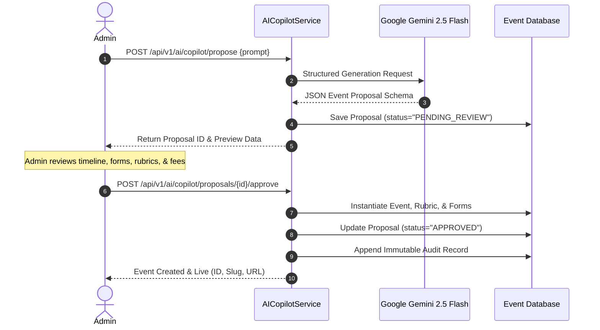

# SapthaEvent AI Copilot Architecture

## 1. Vision & Safeguards
The **SapthaEvent AI Copilot** (`services_copilot.py`) empowers university faculty, club leaders, and event managers to spin up complex multi-day events from a single prompt in natural language.

### Core Principle: Human-in-the-Loop (HITL)
AI must **never** directly mutate live production databases or publish unreviewed events to students. All AI output is generated as a draft proposal (`PENDING_REVIEW`) which must undergo human review and explicit approval by an authorized administrator before being committed to production.



---

## 2. Gemini 2.5 Flash Structured Generation
The copilot leverages the `google-genai` Python SDK calling `gemini-2.5-flash`:
- Enforces strict JSON Schema return types (`response_mime_type="application/json"`).
- Uses system instructions embedding SapthaEvent domain taxonomy.
- Normalizes variations in output types (e.g. mapping "Hackathon Competition" to canonical template type `hackathon`).

### System Instruction Spec:
```
You are an expert university event architect.
Given an event description, produce a valid, comprehensive event configuration JSON object containing:
- title, short_description, description, category, event_type, event_mode ('offline'|'online'|'hybrid')
- capacity (int), fee (float)
- form_fields: list of {id, label, type, required, options}
- rubric: list of {name, weight, description}
- workflow_steps: list of {id, label, order}
- ticket_tiers: list of {id, name, price, capacity}
```

---

## 3. Heuristic Baseline Fallback
In environments without external API keys or during upstream outages:
- The copilot automatically degrades to an intelligent deterministic regex and pattern extraction engine.
- Extracts dates, capacities, technical tracks, and modes from the natural language prompt.
- Selects the closest matching turnkey template and synthesizes a complete proposal without failure.

---

## 4. Proposal Approval & Audit Trail
When the administrator clicks "Approve Proposal":
1. `AICopilotService.approve_and_apply_proposal` instantiates the event using `EventService.create_event()`.
2. Form fields are written to `event_forms`.
3. Rubrics are written to `event_rubrics`.
4. A permanent record is committed to `audit_log` linking the reviewer's ID, the original prompt, and the resulting event ID.
