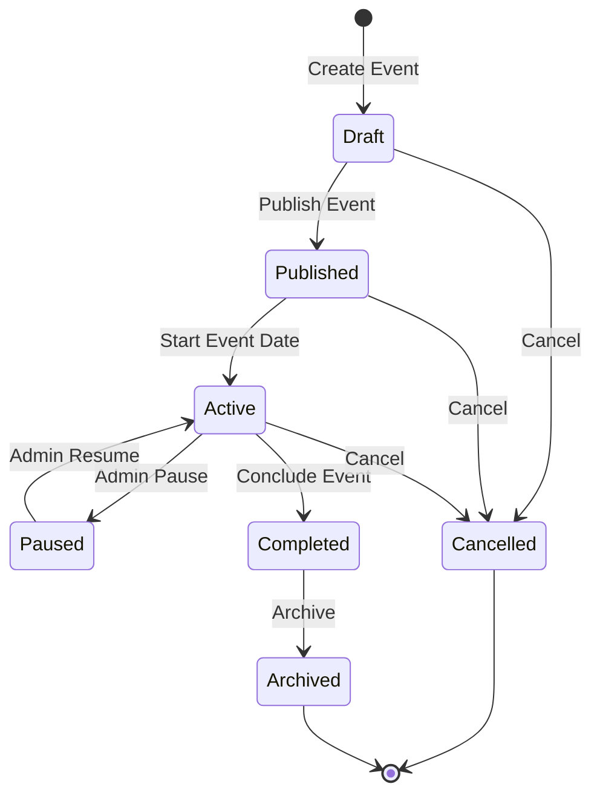

# SapthaEvent Core Event Engine

## 1. Overview
The Core Event Engine (`services_event.py`) provides the universal foundation for managing any event type on SapthaEvent. It eliminates hardcoded assumptions about event format, schedule, or team sizes by abstracting event lifecycle, slug generation, data modeling, and cloning into configurable primitives.

---

## 2. Event Lifecycle State Machine



### State Definitions
- **Draft (`draft`)**: Event metadata and pipelines are being configured. Hidden from public catalog.
- **Published (`published`)**: Publicly discoverable; registrations and ticket sales are open.
- **Active (`active`)**: Event is currently in-session; check-ins, matches, sessions, or hackathon sprints are actively monitored.
- **Paused (`paused`)**: Temporary halt (weather delay, server maintenance); all check-in and submission forms are temporarily locked.
- **Completed (`completed`)**: Final results published, certificates issued, attendee feedback collected.
- **Archived (`archived`)**: Read-only historical record.
- **Cancelled (`cancelled`)**: Event terminated; registrations refunded or voided.

---

## 3. Universal Event Schema

Every event is modeled as a unified record regardless of whether it represents a hackathon, conference, workshop, esports tournament, or cultural gala:

```json
{
  "id": "uuid4",
  "slug": "quantum-computing-symposium-2026",
  "organization_id": "snpsu-main",
  "title": "Quantum Computing Symposium 2026",
  "description": "Comprehensive technical symposium on quantum algorithms.",
  "category": "Technical",
  "event_type": "conference",
  "event_mode": "hybrid",
  "status": "active",
  "venue": "Sir CV Raman Hall",
  "date": "2026-11-20",
  "start_datetime": "2026-11-20T09:00:00Z",
  "end_datetime": "2026-11-21T18:00:00Z",
  "deadline": "2026-11-15T23:59:59Z",
  "capacity": 300,
  "pricing_type": "paid",
  "fee": 500.0,
  "currency": "INR",
  "ticket_tiers": [
    {
      "id": "student-pass",
      "name": "Student Pass",
      "price": 250.0,
      "capacity": 200,
      "status": "available"
    },
    {
      "id": "vip-delegate",
      "name": "VIP Delegate",
      "price": 1000.0,
      "capacity": 50,
      "status": "available"
    }
  ],
  "custom_fields": [
    {
      "id": "ieee_membership_no",
      "label": "IEEE Membership Number (Optional)",
      "type": "text",
      "required": false
    }
  ],
  "created_at": "2026-09-17T08:00:00Z",
  "updated_at": "2026-09-17T08:00:00Z"
}
```

---

## 4. Slug Generation & Conflict Resolution
Slugs are URL-safe, SEO-optimized identifiers (e.g., `/events/ai-hackathon-2026`).
- Cleans non-alphanumeric characters.
- Converts to lowercase with hyphen separators.
- Appends counter suffix (`-1`, `-2`, etc.) when collisions occur.
- Handles dual-database lookups efficiently.

---

## 5. Event Cloning Engine
Organizers can duplicate recurring annual or semester events:
```python
cloned = EventService.clone_event(
    db,
    source_event_id="source-uuid",
    new_title="Quantum Computing Symposium 2027",
    date_offset_days=365,
    cloned_by="admin-user-id"
)
```
- Preserves all workflow stages, custom form questions, evaluation rubrics, and ticket tier definitions.
- Automatically resets participant lists, registrations, project submissions, and judge scores.
- Re-generates unique ticket codes and slugs for the new event instance.
