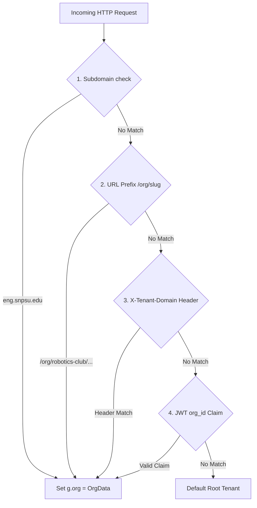

# SapthaEvent Multi-Tenancy Architecture

## 1. Overview
SapthaEvent supports true multi-tenancy (`middleware_tenant.py`). A single deployed cluster can concurrently host independent colleges, university departments, student clubs, and corporate partners with complete data isolation, branded discovery catalogs, and dedicated administration.

---

## 2. Tenant Resolution Workflow



### Resolution Hierarchy:
1. **Subdomain Resolution**: `cs.snpsu.edu.in` resolves to the Department of Computer Science.
2. **Path-Based Prefix**: `/org/acm-student-chapter/events` resolves to the ACM chapter.
3. **HTTP Header**: `X-Tenant-Domain: biotech-dept.edu` for headless API clients and mobile applications.
4. **JWT Claim**: API requests carrying Bearer tokens automatically extract `org_id` from token payload.

---

## 3. Data Segregation Model

### Logical Isolation via Discriminator Columns
In the relational layer (and corresponding Firestore collections), all core records enforce an `organization_id` foreign key:
```sql
SELECT * FROM events 
WHERE organization_id = :current_tenant_id 
  AND status = 'active';
```

### Administrative Guard
The tenant middleware injects `g.org` into the Flask execution context. All service mutation methods (`services_event.py`, `services_workflow.py`) assert that the modifying actor's organizational boundary encompasses the target resource.

---

## 4. Custom Tenant Branding & Theming
Each tenant record stores customizable design tokens:
```json
{
  "id": "org-robotics",
  "slug": "robotics-club",
  "name": "SNPSU Robotics & Autonomous Systems",
  "branding": {
    "primary_color": "#0ea5e9",
    "accent_color": "#f43f5e",
    "logo_url": "https://storage.googleapis.com/.../robotics-logo.svg",
    "banner_url": "https://storage.googleapis.com/.../robotics-hero.jpg",
    "custom_domain": "robotics.snpsu.edu.in"
  }
}
```
The Jinja2 base templates and CSS variables dynamically bind to `g.org.branding` to transform colors, logos, and header banners.
