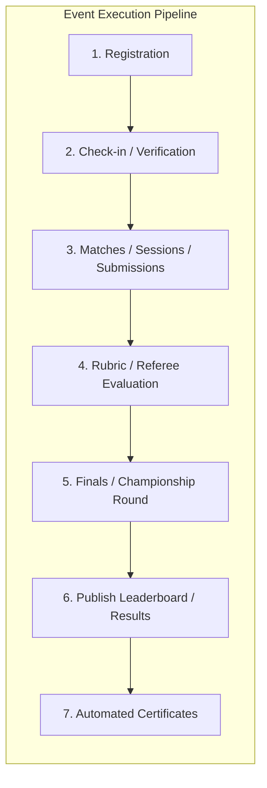

# SapthaEvent Workflow Engine

## 1. Overview
The SapthaEvent Workflow Engine (`services_workflow.py`) coordinates the sequential and parallel stages of an event's operational lifecycle. Rather than assuming static milestones, every event operates as a directed pipeline where stage transitions are auditable, verifiable, and rule-governed.

---

## 2. DAG Stage Progression



### Stage Status Values
Each workflow step holds one of four states:
- `pending`: Yet to begin; prerequisites not met.
- `active`: Current stage in progress.
- `completed`: Step accomplished successfully.
- `skipped`: Step intentionally bypassed by an authorized administrator with justification.

---

## 3. Stage Transition Safeguards
Transitions between steps are guarded against invalid sequences:
- Cannot transition to `evaluation` if `registration` is still active and zero submissions exist.
- Cannot transition to `results` before all assigned judging evaluations or referee scorecards are submitted.
- Cannot emit certificates before winners or attendees are finalized.

### Transition Service Example:
```python
from services_workflow import WorkflowService

result = WorkflowService.transition_event_step(
    db,
    event_id="evt-uuid",
    target_step_id="evaluation",
    actor_id="admin@snpsu.edu.in",
    notes="Registration closed with 48 teams confirmed. Beginning preliminary evaluations."
)
```

---

## 4. Immutable Audit Logging
Every workflow transition records a non-repudiable audit event in the `audit_log` collection:
```json
{
  "id": "audit-7f3b901a",
  "action": "workflow_step_transition",
  "event_id": "evt-uuid",
  "previous_step": "registration",
  "target_step": "evaluation",
  "actor_id": "admin@snpsu.edu.in",
  "ip_address": "192.168.1.100",
  "user_agent": "Mozilla/5.0 ...",
  "timestamp": "2026-09-17T11:00:00Z",
  "metadata": {
    "notes": "Registration closed with 48 teams confirmed."
  }
}
```

---

## 5. Event-Driven Automations
Stage changes automatically fire downstream event webhooks and background jobs:
- `registration` → `active`: Sends SMS/Email reminders 24h before event.
- `checkin` → `completed`: Unlocks live submission portal for present teams only.
- `results` → `published`: Triggers instant push notifications and WhatsApp blast to all registered participants.
- `certificates` → `active`: Enqueues async batch generation of high-resolution PDF credentials.
